Ohara Quickstart VM
==============================

Prerequisites
-------------

* OS: Windows / Linux / MacOS
* `VirtualBox <https://www.virtualbox.org/>`_ 5.2+: Oracle VM VirtualBox, is a free and open-source virtual machine.
* `Ohara Quickstart VM image <https://github.com/oharastream/ohara-quickstart/releases>`__: An OVA (Open Virtual Appliance)
  file, a pre-prepared virtual machine image for Ohara quickstart. You can download the image file (`.ova`) from the 
  `release page <https://github.com/oharastream/ohara-quickstart/releases/>`__

    .. figure:: images/download_assets.png
       :alt: download_assets
       :target: https://github.com/oharastream/ohara-quickstart/releases

  .. note::
    You might have noticed there's another file listed right under the "ohara-quickstart-0.9.0.ova". It's a stream jar that could be used later in our tutorial where we walks you through how to use our UI. You could download it if you would like to follow along with our tutorial later on.

Installation
------------

VirtualBox
^^^^^^^^^^

  Please download the virtualbox from `here <https://www.virtualbox.org/wiki/Downloads>`_, and reference
  `this article <https://www.virtualbox.org/manual/ch02.html>`__ on how to install it on your machine.

Import Quickstart VM
^^^^^^^^^^^^^^^^^^^^

  You can use VirtualBox user interface to import the Ohara Quickstart VM (ova file):

  **Main menu -> File -> Import Appliance**

Setup VirtualBox network adapter
^^^^^^^^^^^^^^^^^^^^^^^^^^^^^^^^

Quickstart VM requires a **Host-only network adapter** to be configured so that you can connect from the host machine to
guest machine (Quickstart VM).

  .. note::
    Quickstart VM uses network adapter ``vboxnet0`` with DHCP Server enabled as **default Host-only adapter**,
    if there is already a ``vboxnet0`` adapter in your VirtualBox, you can just skip this step.

.. tabs::

  .. tab:: Mac/Linux

    1. Create new network adapter

       Click **Tools** and then click **Create**, ensure that the DHCP Enable option is
       checked.

      .. figure:: images/mac_add_network.jpg
         :alt: create\_network\_mac
         :scale: 30%

         MacOS - Create network adapter

    2. Setting network adapter

       Select the imported ohara-quickstart VM, click **Setting**, then click **Network**, and
       click **Adapter2**, select **Host-only Adapter**, and select the newly added
       network card.

      .. figure:: images/mac_setting_network.png
         :alt: setting\_network\_mac
         :scale: 30%

         MacOS - Setting VM's network adapter

  .. tab:: Windows

    1. Create network adapter

       Click **Global Tools** and then click **Create**, ensure that the DHCP Enable option
       is checked.

       .. figure:: images/win_add_network.png
          :alt: create\_network\_windows
          :scale: 45%

          Windows - Create network adapter

    2. Setting network adapter

       Select the imported ohara-quickstart VM, click **Setting**, click **Network**,
       click **Adapter2**, select **Host-only Adapter**, and select the newly added
       network card.

       .. figure:: images/win_setting_network.png
          :alt: setting\_network\_windows
          :scale: 45%

          Windows - Setting VM's network adapter

Install Ohara
^^^^^^^^^^^^^

Once the Quickstart VM is imported and the network adapter is configured, you can press
the "Start" button to start Quickstart VM and then use the following username and password to log into the system:

- Username: ohara
- Password: oharastream

The installation will be starting automatically if this is your first time log in to the system. This step will take some time to complete as it need to download all Ohara docker images.

  .. figure:: images/vm_ohara_install_1.png
     :alt: abc

     VM is pulling down images from Docker Hub

  .. figure:: images/vm_ohara_install_2.png
     :alt: install_ohara_2

     Finishing the setup

After the installation is complete, you should see something like the following:

  .. code-block:: text

    > Ohara ready on http://192.168.56.105:5050

As we can see in the above, the VM's IP address is `192.168.56.105` (this address can be varied).
We can then open the browser and enter this URL in browser's address bar `http://192.168.56.105:5050`. to open Ohara manager (Ohara's UI, we will introduce it in the following section).

Terminology
-----------
Before jumping into the UI and create our very first workspace and pipeline. Let's get to know some of the terms that we will be using throughout this guide. 

Manager
  Manager is the user interface of Ohara (UI). Ohara Manager provides a friendly user interface allowing user to design their data
  pipeline without even touching a single line of code. 

Node
 Node is the basic unit of running service. It can be either a physical machine or VM.

Workspace
  Workspace contains multiple Ohara services including: Zookeepers, Brokers and Workers. And pipelines are service that run in a workspace

Pipeline
  Pipeline allows you to define your data stream by utilizing **Connector** to connect to external storage systems,
  as well as a **Stream** to customize data transformation and stream processing.

Connector
  Connector is used to connect to the external storage systems. It has two types - source connector and sink connector.
  Source connector pulls data from another system and then push to topic. By contrast, Sink connector pulls data from
  topic and then push to another system.

Stream
  Stream is powered by `Kafka Streams <https://kafka.apache.org/documentation/streams/>`_. Provides users a simple way to write their own stream processing application.

Topic
  A topic is a place where all the data are written just like a database table where data is stored. It acts like a buffer, the data being pull in from the source connector is stored in the topic and later be pulled out again by another component.

UI overview
-----------

Before we proceed, here is a screenshot of Ohara Manager where we show you each component's name so you are better prepared for the upcoming tutorial. You can always come back to this overview if you are lost or not sure what we're talking about in the tutorial.

  .. figure:: images/ui-overview.png
     :alt: UI overview

.. note::
  We do our best to make our docs as clear as we could, if you think there's still room for improvement. We'd love to hear from you: https://github.com/oharastream/ohara/issues

Create your first pipeline
--------------------------

Now, Ohara Manager is up and running, we can use the UI to create our very first pipeline. Here are the steps that we will be going through together: 

- Create a workspace
- Create a pipeline
- Add pipeline components, this includes:

    - A FTP source and a sink connector
    - Two topics
    - A stream
    - Create connections between them
- Start the pipeline 

.. note::
  During the tutorial, we will be using FTP source/sink connectors. And so you will need to prepare your own FTP in order to follow along.

Create a workspace
^^^^^^^^^^^^^^^^^^

Open Ohara Manager with your browser (http://192.168.56.105:5050) and should see a popup window showing up in the middle of your screen:

- Click on the QUICK CREATE button to open a new dialog

  .. figure:: images/intro-dialog.png
     :alt: Intro dialog

- Using the default name: workspace1 and hit the NEXT button

  .. figure:: images/quick-create-workspace-name.png
     :alt: Quick create workspace new name

- Click on the Select nodes and use the ADD NODE button to create a new node. The node info that you need to enter are listed below:

  - Hostname: 192.168.56.102 (fill your own hostname here)
  - Port: 22
  - User: ohara
  - Password: oharastream
  
  .. figure:: images/quick-create-workspace-node.png
     :alt: Quick create workspace new node

  .. figure:: images/quick-create-workspace-add-node.png
     :alt: Quick create workspace add a new node

- The node should be added into the list. Select the node and click on the SAVE button located on the upper right corner to move on
  
  .. figure:: images/quick-create-workspace-select-node.png
     :alt: Quick create workspace select node

- Now, click the NEXT button to finish selecting nodes

  .. figure:: images/quick-create-workspace-node-summary.png
    :alt: Quick create workspace node summary

- We don't need to upload any worker plugins, so we can skip this step by clicking on the NEXT button

 .. figure:: images/quick-create-workspace-plugins.png
    :alt: Quick create workspace new plugins

- Click on the FINISH button to finish up the settings.

 .. figure:: images/quick-create-workspace-summary.png
    :alt: Quick create workspace summary

- A new popup window will open where it shows you the creating progress. This usually take a while to finish. Once it's done, All popup windows will be close. And the UI will automatically redirect you into the newly create workspace: Workspace1

 .. figure:: images/quick-create-workspace-progress.png
    :alt: Quick create workspace creating progress

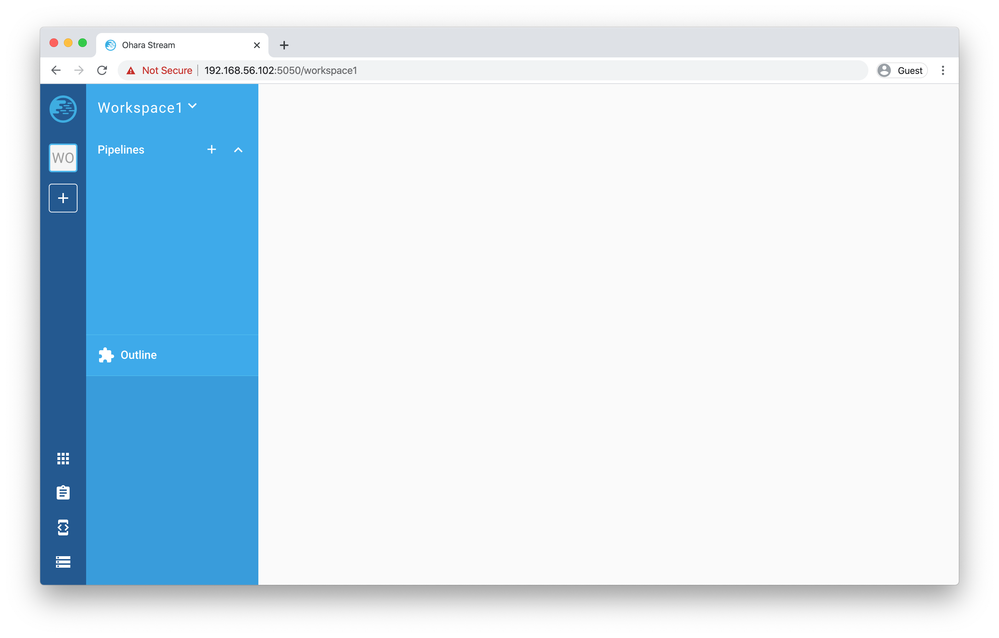

.. tip::
  You can create more workspace with the plus (+) icon in the App bar.

Create a pipeline
^^^^^^^^^^^^^^^^^

Create a pipeline is fairly simple:

- On the Navigator, click on the plus icon.
- In the popup window, enter the name: pipeline1 and click the ADD button

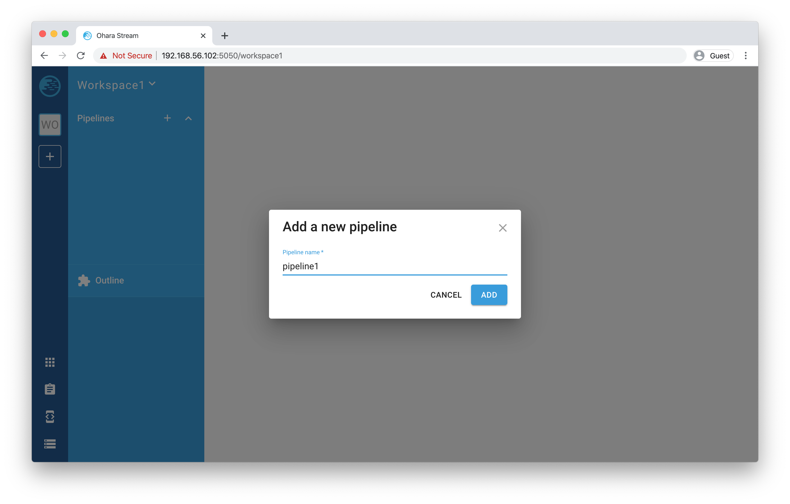

- The new pipeline will be added into the workspace and listed in the Navigator. And just like creating workspace, you are also redirected into the pipeline you just created. 

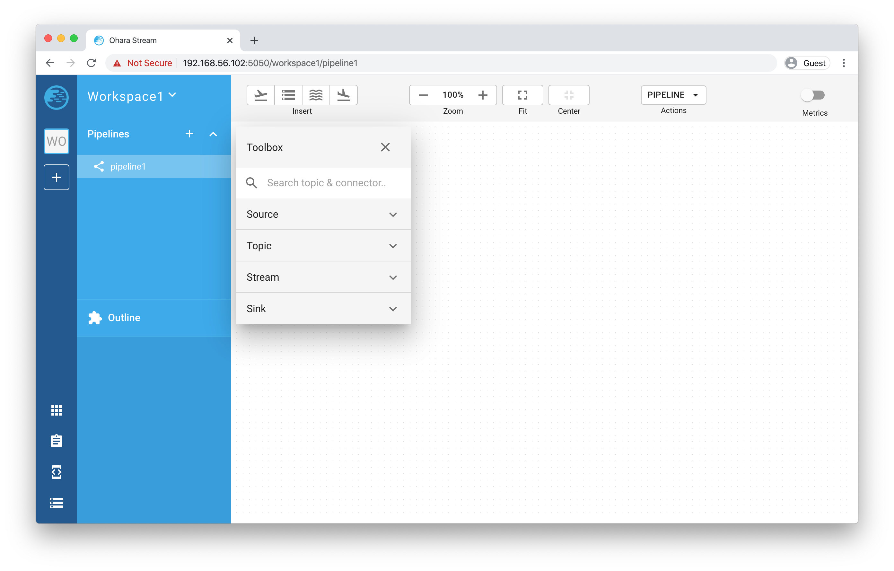

Add pipeline components
^^^^^^^^^^^^^^^^^^^^^^^

Since workspace and pipeline are both ready. We can now add new components into the pipeline. The pipeline connection we're about to create will be looking like: ``FTP source -> topic -> stream -> topic -> FTP sink``.

Before we start, please make sure your FTP service is ready and let's get started!

Drag and drop new pipeline components
"""""""""""""""""""""""""""""""""""""

**FTP source:**

- From the Toolbox (Please refer to the overview image for what is Toolbox)
- Click on the title "Source", the panel will be expanded and display all available source connectors

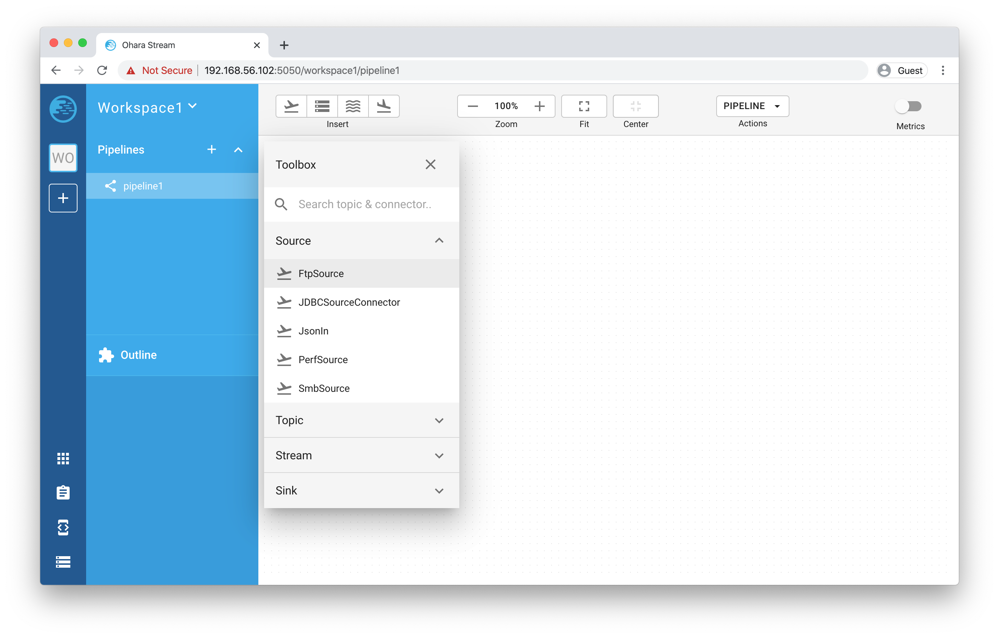

- Drag the "FtpSource" from the list and drop into the Paper (Don't worry about the position. This can be changed by simply dragging the component after they're added into the Paper). A prompt will be asking you about the connector name, let's name it "ftpsource" and click the ADD button.

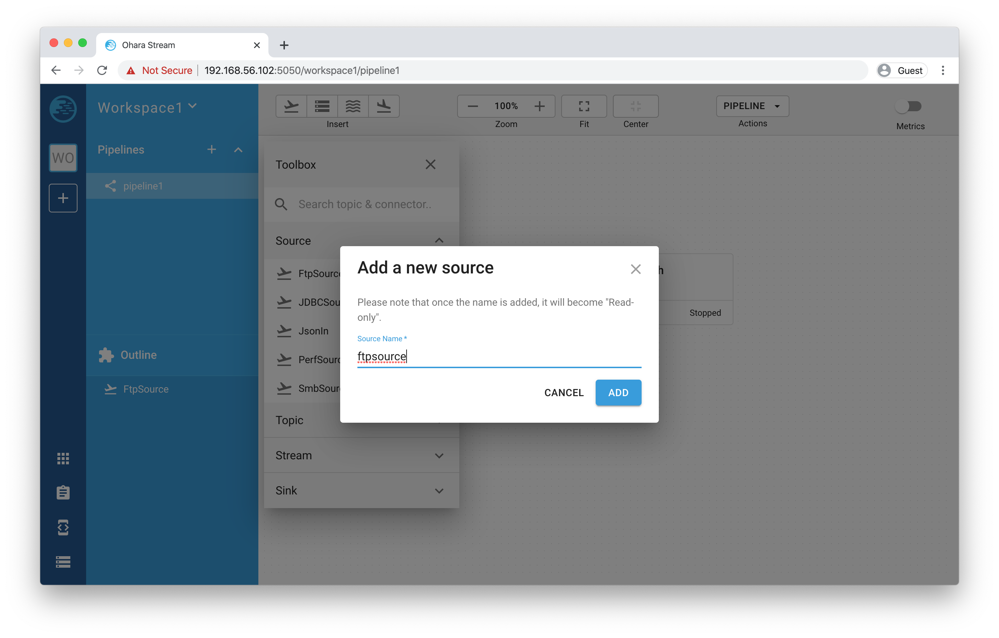

- The FTP Source connector should display in the Paper:

.. figure:: images/ftpsource-add-done.png
   :alt: Add a FTP source name done

- Now, hover over the FtpSource connector, a couple of buttons will show up. These are action buttons, let take a quick look (from left to right):

  .. figure:: images/ftpsource-add-action-buttons.png
    :alt: Action buttons

  - **Link**: create a new link, once a link is created you can move your mouse and the link will follow along your mouse position. To link to another component, you can hover over it and do a mouse right-click. To cancel the link creation, just click on the blank within the Paper.

    .. tip::
      A link can also be interacted with. You can remove it by clicking on the "x" button. And click on any point of the link creates a vertex. The vertex can be moved and tweaked to change its position. You can also delete a vertex by double clicking on it.

  - **Start**: start a component. Once the component is properly configured, you can then use this button to start the component.
  - **Stop**: stop a running or failed component
  - **Configure**: open the Property dialog and fill out necessary configuration for the component.
  - **Delete**: delete the selected component.

- Enough of these button things. Let's click on the "configure" icon (a wrench) and fill in the following fields (Note that you need to use your own settings, and create a completed, an error, an input and output directories). For fields that we did not mention below, the default is used:

  - Completed Folder: demo/completed
  - Error Folder: demo/error
  - Hostname of FTP Server: 10.2.0.28
  - Port of FTP Server: 21
  - User of FTP Server: ohara
  - Password of FTP Server: oharastream
  - Input Folder: demo/input

- Once these settings are filled out, click on the "SAVE CHANGES" button.

  .. figure:: images/ftpsource-add-config.png
    :alt: Add a FTP source configuration

  .. warning::
    There are validation rules that prevent you from submitting the form without filling require fields.

**FTP sink:**

Just like FTP source connector, we can drag and drop a FTP sink connector from the Toolbox and name it "ftpsink". Click on its "configure" button. The settings are mostly like FTP source with the only exception: "output":

  .. figure:: images/ftpsink-add-toolbox.png
    :alt: Add a FTP source configuration

  .. figure:: images/ftpsink-config.png
    :alt: Add a FTP source configuration

  - Hostname of FTP Server: 10.2.0.28
  - Port of FTP Server: 21
  - User of FTP Server: ohara
  - Password of FTP Server: oharastream
  - Output Folder: demo/output

Create! Now we have both source and sink connectors ready. Let's move on to create topics.

  .. figure:: images/ftpsink-add-done.png
    :alt: Add a FTP source configuration

**Topic:**

In this tutorial, we need two topics, let's add them from the Toolbox like what we did for FTP connectors:

- From the Toolbox, click on the title "Topic" to expand the topic panel.

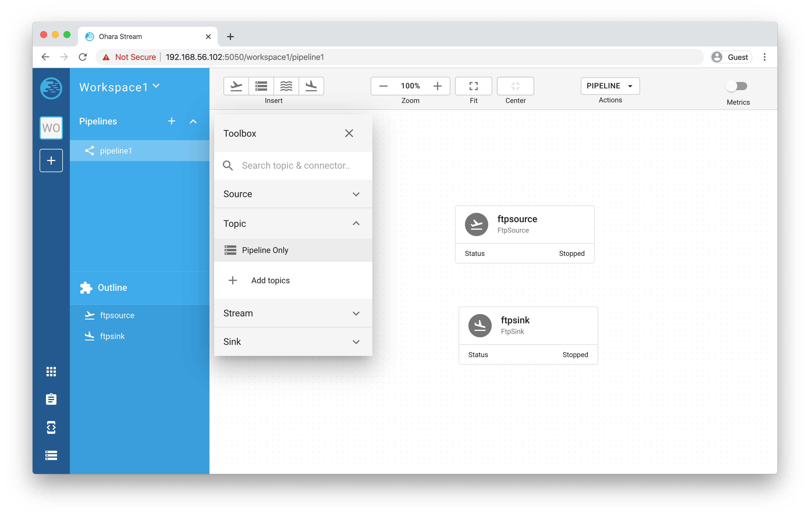

- Drag "Pipeline Only" from the list and drop it into the Paper to add a new Topic. Unlike source or sink connector, add a topic doesn't require to enter a name, the name will be generated like (T1, T2, T3, etc.)
- Repeat the above step to create another Topic. You should now have two topics (T1, T2) in your Paper in addition to those FTP connectors:

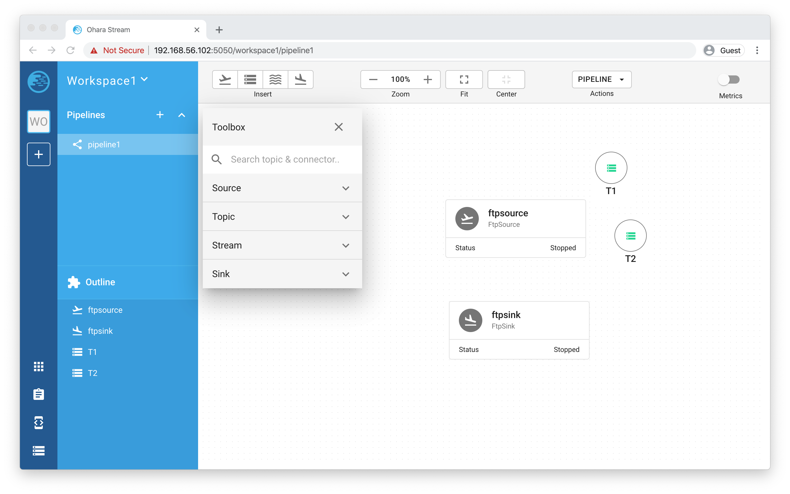

And lucky, there's no need to configure these topic as they're preconfigured by us. (what a time saver!) 

.. note::
  In Ohara, topics can either be a "Pipeline-only topic" or a "Shared topic". The pipeline-only topics are topics that only live within a pipeline. And on the other hand, shared topics can be shared and used across different pipelines. For simplicity sake, we only use pipeline-only topics throughout the tutorial.

.. tip::
  For quickly creating a new pipeline-only topic, you can also just add a source and a sink (or stream) connector and then link them together with the "Link" button from the source connector component. The pipeline-only topic will be created automatically.

**Stream:**

Stream is our last missing piece of the puzzle. Let's add one very quick!

Remember the `stream jar <https://github.com/oharastream/ohara-quickstart/releases>`_ you downloaded along with the quickstart image? It's time to use it:

- Click on the "Stream" panel on the Toolbox and then click on the "Add streams" button

- It will open your OS file system. Now, select the stream jar file you downloaded. The stream class will be loaded and display in the list:

- Adding a stream is just like connector and topic, drag and drop a stream into the Paper and give a name "stream"

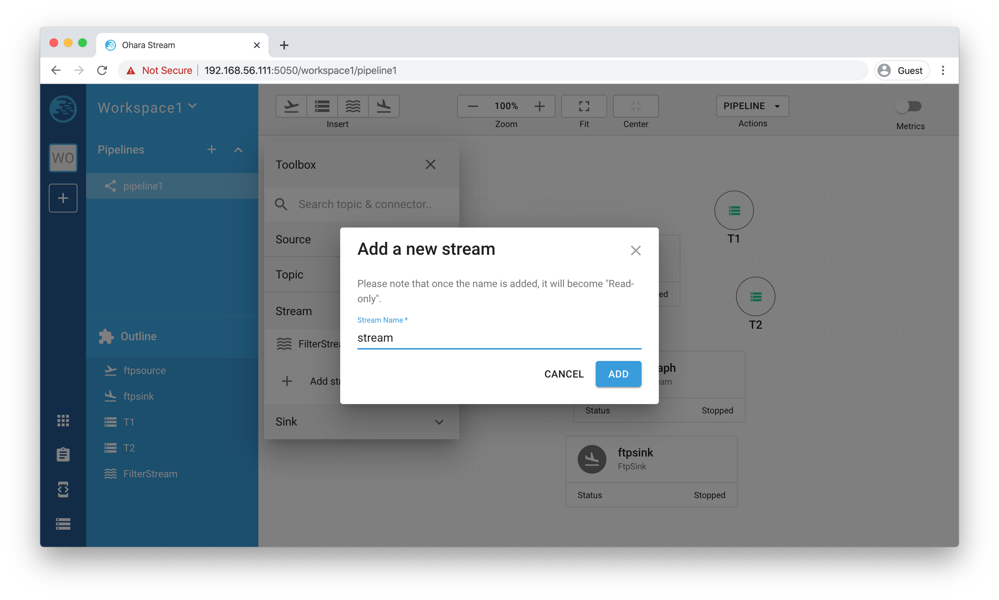

- Now let's work through the configuration together. Hover over the stream component and click on the "Configure" button to open the configure dialog
- Fill out the form with the following settings and click the "SAVE CHANGES" button:

  - filtered header name: "Sex"
  - filtered value: "M"
  - Node name list: 192.168.56.111 (you should use you own IP)

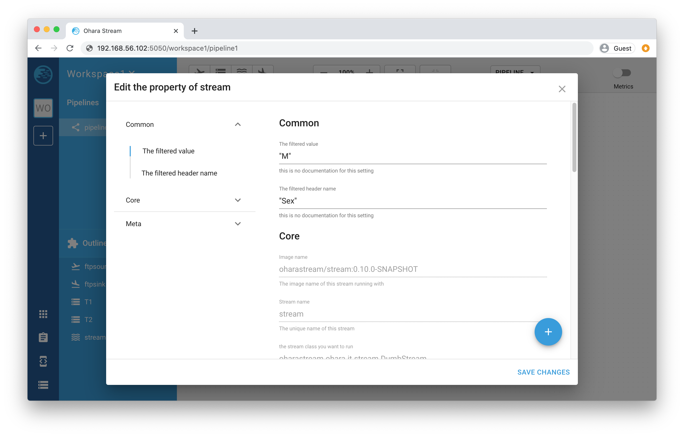

.. warning::
  After the node name is filled, you must hit the enter key in order to properly enter the value.

.. note::
  This filter stream is capable of filtering out columns and values that we specified and push the new result to a topic. Here we're specifically set the "Sex" header and "M" (stands for Man) and so our output data will only include data that contains "M" in the "Sex" column. We will verify the result later in the tutorial.

Everything is ready. Let's create the connection like we mentioned earlier: ``FTP source -> topic -> stream -> topic -> FTP sink``.

- Hover over FTP source connector and click the "Link" button, and move your mouse to the first topic named "T1" and click on it. A connection should be created:

- Repeat the same step but this time with "T1" to create a connection between T1 and stream
- And stream -> T2 then T2 -> FTP sink connector. After you are done, you should have a graph like this (Components position have been tweaked so it's better to see the relation between these components):

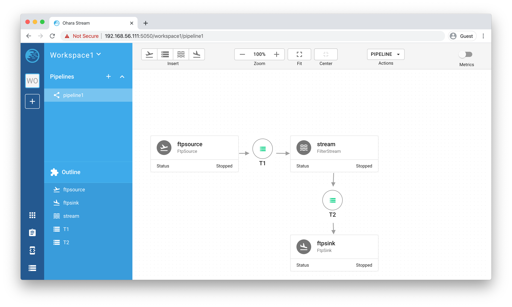

You might have noticed that the Toolbox has disappeared, and that is because we have closed it in order to have a larger space to work with in Paper. You can do this by clicking on the "x" located on the upper right corner of Toolbox.

.. note::
  You can also create the connection during configuring the connector or stream. For connector, just choose the topic from its topic list. For stream, you will need to choose both from and to topics from the topic list.

Start pipeline components
^^^^^^^^^^^^^^^^^^^^^^^^^

So far so good, let's start all the components simply by clicking on the "Start all components" button located on the Toolbar menu. If everything goes well you should see that all components' icon trued green just like the following image:

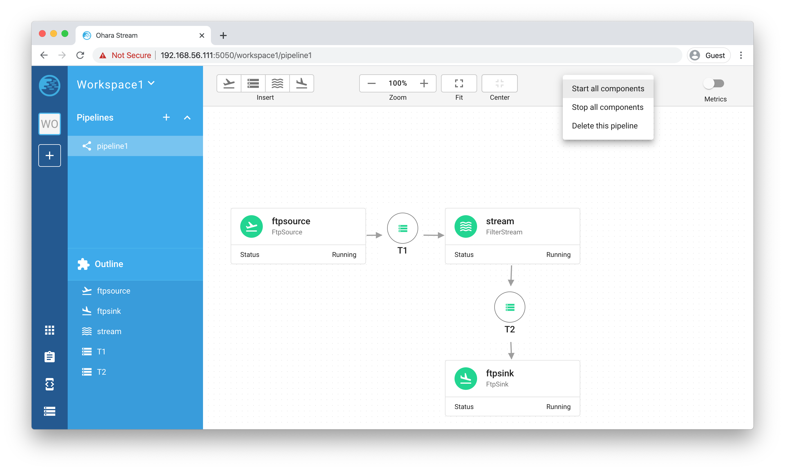

Test our new pipeline
^^^^^^^^^^^^^^^^^^^^^

Let's test this "pipeline" see if it's capable of transferring some data. We have prepared a CSV file which looks like this (you can grab the file from this `URL <https://people.sc.fsu.edu/~jburkardt/data/csv/freshman_kgs.csv>`_ ):

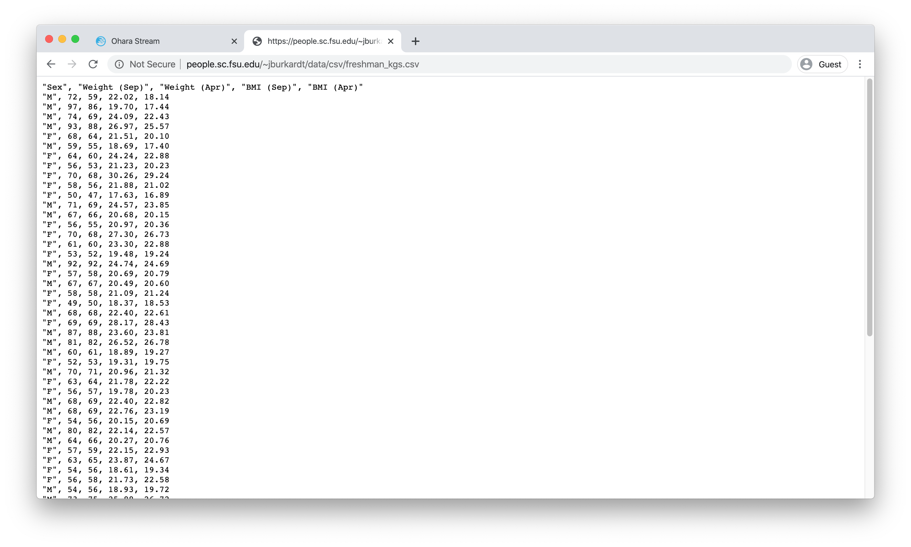

Upload the file to the FTP service's input folder. Wait a while, the file should be consumed and move to the output folder. You can verify if the data is properly transferred by using a FTP client to check the file (we're using `FileZilla <https://filezilla-project.org/>`_ ).

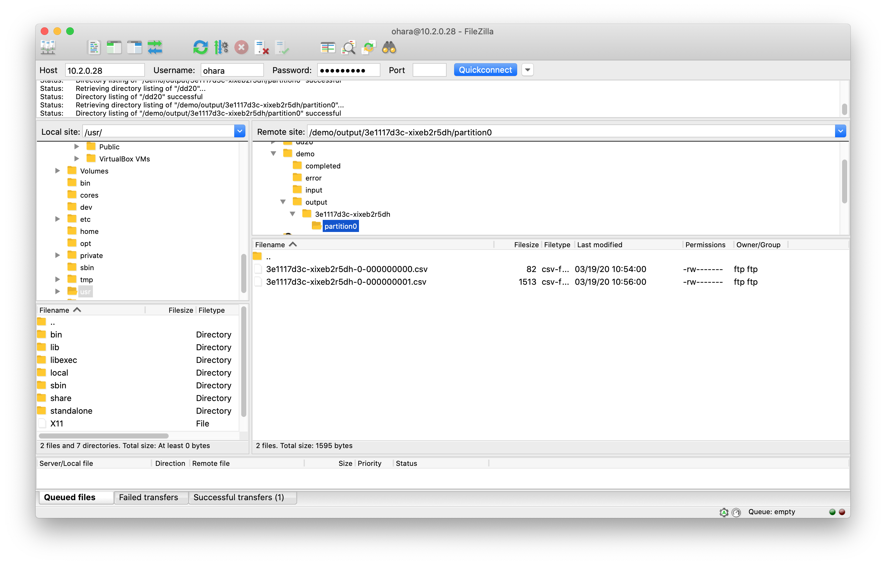

The output data should be filtered with the result only "M" (man) data are listed as shown below:

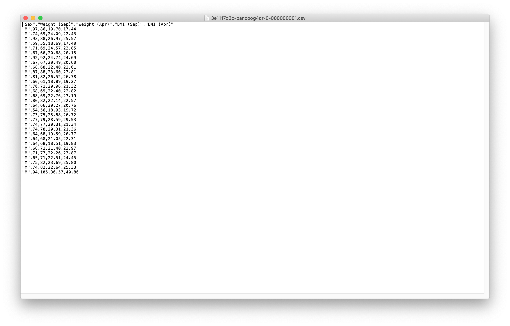

Troubleshooting
---------------

We now provide a few debugging tools that can help you pin down unexpected errors:

- Event log panel:

  All UI events are recorded, things like API request and response are also stored. You can view all you event log by simple opening up the Event log panel. As you can see in the screenshot, errors are highlighted and have more detail that can be viewed when click on each of them.

  .. figure:: images/event-log-icon.png
    :alt: Event log icon

  .. figure:: images/event-log-list.png
    :alt: Event log list

  .. figure:: images/event-log-dialog.png
    :alt: Event log dialog

  Another thing that is worth mentioning here is that whenever there are errors occurred. The Event log icon will keep tracked of the errors and display the error log number right on its icon: 

  .. figure:: images/event-log-notification.png
    :alt: Event log notification

- Developer Tools panel:

  Open the dev tool from the App bar:

  .. figure:: images/devtool-icon.png
    :alt: DevTool icon
  
  There are two main functionalities that could be utilized here:

  - Topic panel: you can quickly preview the topic data here

  .. figure:: images/devtool-topic-data.png
    :alt: DevTool topic data

  - Log panel: view all running service's full log

  .. figure:: images/devtool-topic-log.png
    :alt: DevTool topic log
